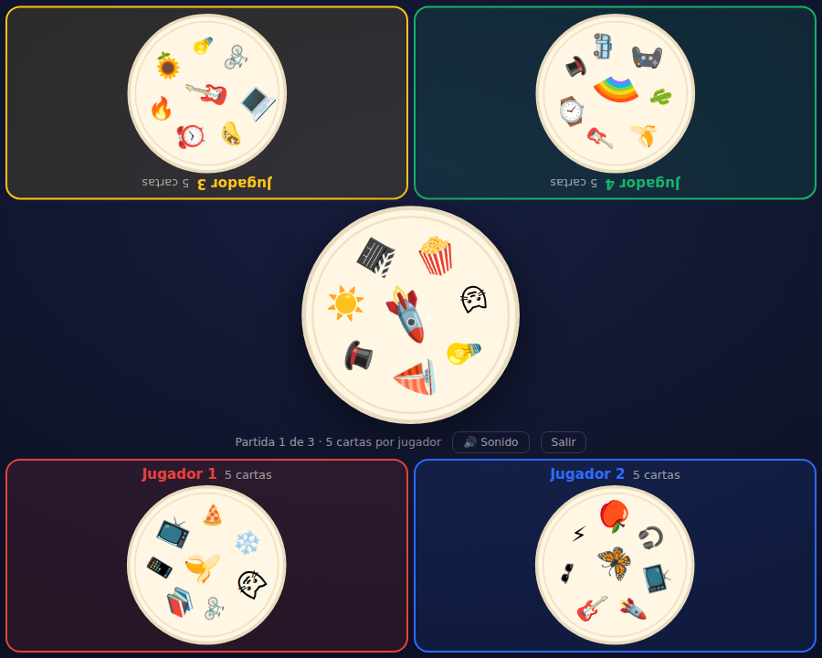

# 🃏 Agilízate — Edición Figuras

Juego de cartas de **agilidad mental** para **2 a 6 jugadores** en una sola pantalla.
Cada carta trae 8 objetos cotidianos; entre cualquier par de cartas siempre hay **exactamente un objeto igual**. ¡El primero en encontrarlo y descartar todas sus cartas gana!

## ▶️ Jugar ahora

### 👉 **https://danyarellano119-star.github.io/performance-evaluation-report/agilizate/**

Ábrelo en el celular, la tableta o la computadora. No hay que instalar nada.
Para jugar en grupo, pon un teléfono o tableta al centro de la mesa.

## Cómo se juega

1. Se reparten las cartas entre los jugadores; la que sobra abre el centro de la mesa.
2. Cada jugador ve **solo la carta de encima de su pila** — nadie sabe qué cartas le quedan a los demás.
3. Todos juegan **al mismo tiempo**: busca el objeto que tu carta comparte con la del centro y **tócalo en tu carta**.
4. Si aciertas, tu carta cae al centro y se vuelve la nueva carta a igualar.
5. Si te equivocas, te congelas un instante.
6. **Gana el primero en quedarse sin cartas.**

En computadora cada jugador también puede usar su zona; en el celular o la tableta se toca directamente. Las zonas de arriba se muestran giradas 180° para los jugadores que están del otro lado de la mesa.

## Características

- **2 a 6 jugadores** en el mismo dispositivo.
- **Cartas por jugador configurables** (5, 7, 9 o el máximo que permita el mazo).
- **Sesiones de varias partidas** (1, 3, 5 o 7) con marcador acumulado.
- **Nombres personalizados** para cada jugador.
- **Tabla final** con el ganador de cada partida y las victorias totales.
- **Usuarios e historial guardados** en el dispositivo: los jugadores frecuentes aparecen como fichas para reutilizarlos y se llevan sus estadísticas de partidas jugadas y ganadas.
- **Sonidos** de cuenta regresiva, acierto y error.
- Diseño **responsivo** (teléfono, tableta y computadora) y con tema claro/oscuro automático.

## Cómo correrlo

- **En línea (recomendado):** usa el enlace de arriba.
- **Sin internet:** descarga `index.html` y ábrelo con doble clic — es un solo archivo, sin dependencias ni instalación.

## Detalles técnicos

- Un único archivo HTML con CSS y JavaScript, **sin librerías externas**.
- El mazo de **55 cartas** se genera con un **plano proyectivo de orden 7**, lo que garantiza que cualquier par de cartas comparta exactamente un objeto.
- Los objetos son emojis del sistema, así que se ven nítidos en cualquier dispositivo.
- El historial se guarda con `localStorage` (en el navegador y dispositivo donde se juega).

## Notas

- El historial se guarda **por dispositivo/navegador**; no se comparte entre teléfonos.
- No se incluyen logos de marcas registradas; se usan objetos cotidianos genéricos.
